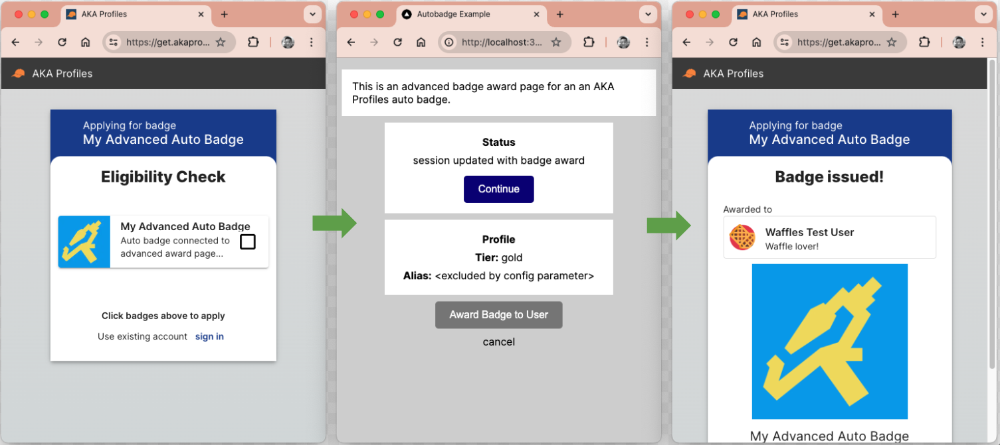

This is the starting code for creating a badge award page for an AKA Profileas auto badge.

See [AKA Profiles](https://www.akaprofiles.com/docs/auto-badge-integration/overview) for more details.

## Simple Example (src/app/simple)

Simple button which awards the badge when clicked.

### Run Instructions

1. Update `API_KEY` in `.env` file with your API key from [AKA Profiles](https://app.akaprofiles.com)
2. Update `AES_KEY` in `.env` with a 256-bit, base64 encoded encryption key (See http://localhost:3000 to copy a random key).
3. Start the development server (e.g. npm run dev)
4. Create an auto badge in [AKA Profiles - Auto Badges](https://app.akaprofiles.com/creator/badges) and set the `Badge Award Page` to http://localhost:3000/simple
5. Open the `get badge link` in a browser

[Simple auto badge configuration screenshot](simple.png)

## Advanced Example Instructions (src/app/advanced)

Different auto badges can share the same badge award page, with unique behavour based on configuration parameters.

- Demonstrates passing in a 3rd party API key as configuration parameter
- Demonstrates returning different data on badge award based on configuration parameters

### Run Instructions

Run steps 1 to 3 for simple badge above, then:

4. Create an auto badge in [AKA Profiles - Auto Badges](https://app.akaprofiles.com/creator/badges) and set the `Badge Award Page` to http://localhost:3000/advanced
5. Add Configuration Parameters: apikey = test123, includeAlias = true
6. Add Data Fields: tier, alias
7. Open the `get badge link` in a browser
8. Create another auto badge, but this time set includeAlias = false to see the difference

[Advanced auto badge configuration screenshot](advanced1.png)

[Advanced auto badge data screenshot](advanced2.png)

## Code Overview

Folders under src/app:

- simple: simple badge award page example
- advanced: badge award page example with configuration parameters and returning data with award
- serverActions: AKA Profiles API calls wrapped in Next.js server actions
- util: encryption functions and other helpers
- mockAPI: mock 3rd party API used by advanced example

Next.js server actions are used to prevent API_KEY, AES_KEY, and unencrypted JWT token being exposed in the client.
